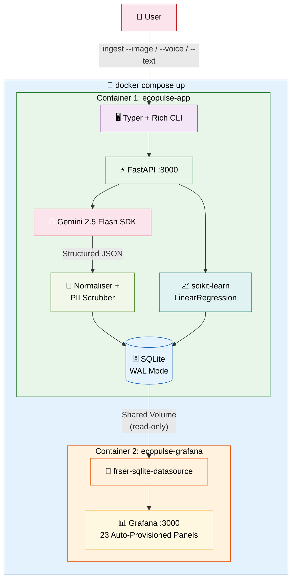
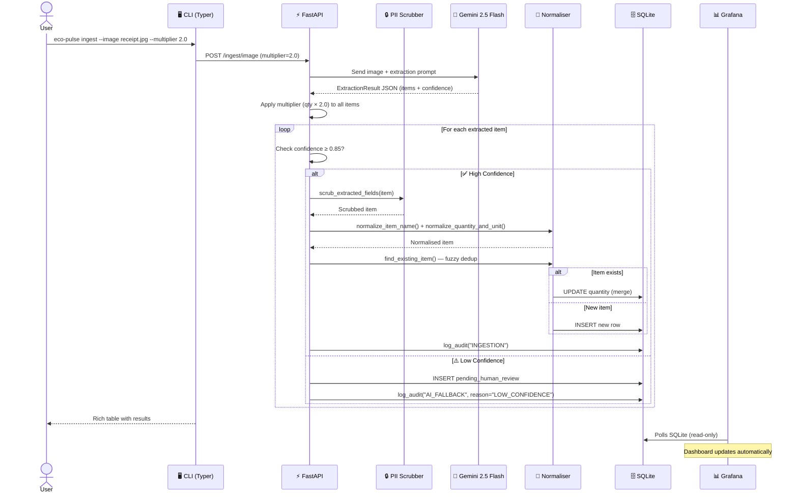
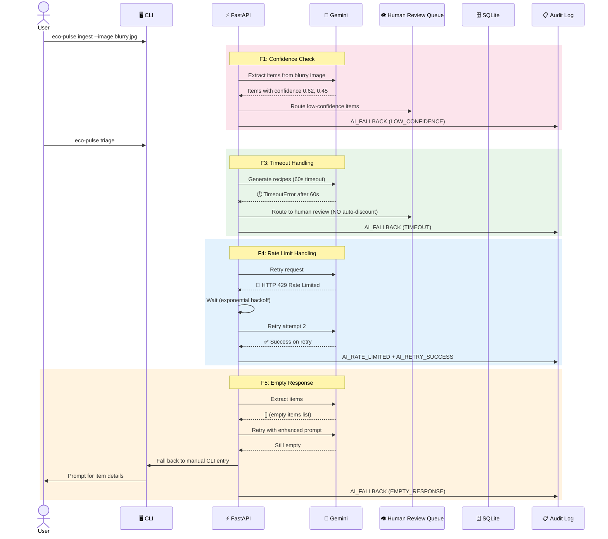
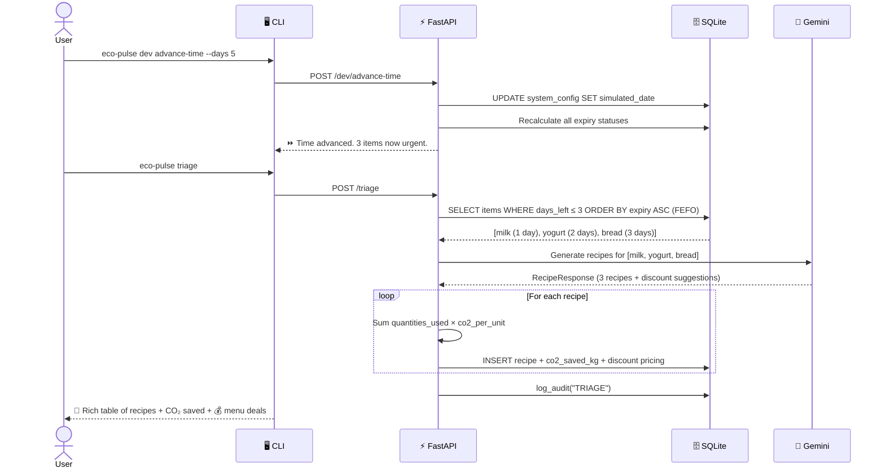
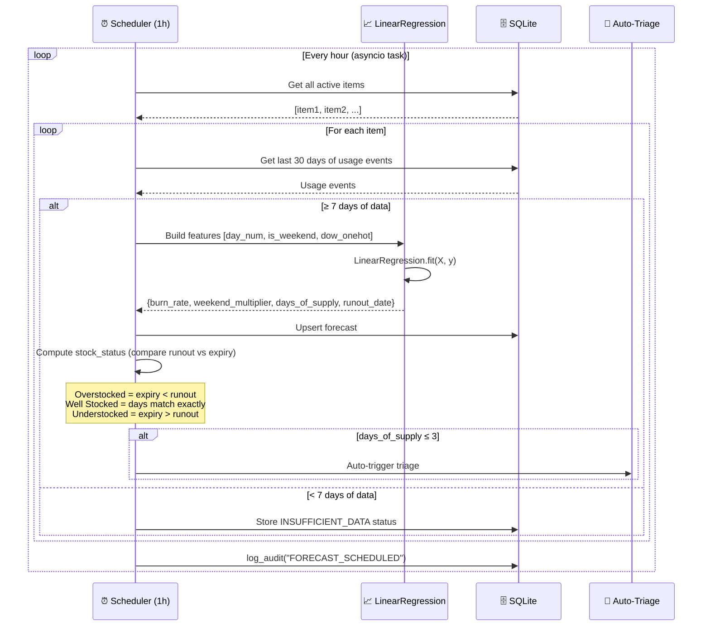
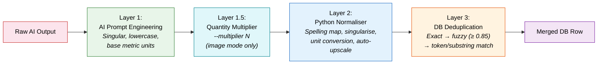

<div align="center">

# 🌿 Eco-Pulse V3.0

### The Zero-Waste Inventory Engine

**AI-powered inventory lifecycle manager · 2 Docker containers · Zero frontend code**

[](https://www.python.org/)
[](https://fastapi.tiangolo.com/)
[](https://ai.google.dev/)
[](https://sqlite.org/)
[](https://grafana.com/)
[](https://docs.docker.com/compose/)
[](https://opensource.org/licenses/MIT)

<br/>

*Small businesses waste up to 15% of perishable inventory because tracking is tedious and analytics are non-existent. Eco-Pulse fixes this with a single command.*

</div>

---

## 📋 Submission Details

**Candidate Name:** Yathin S

**Scenario Chosen:** Green-Tech Inventory Assistant

**Estimated Time Spent:** ~5.5 hours

| Phase | Time | Details |
|---|---|---|
| Implementation design | ~1.5 hrs | Explored the problem space, drafted [Initial_idea.md](Initial_idea.md), then iterated into [improved_idea.md](improved_idea.md) — a detailed implementation prompt that guided all code generation. Investing heavily here meant the generated code was accurate from the start. |
| Code generation | ~1 hr | Generated the full backend, CLI, AI service, normalizer, forecasting engine, and test suite from the implementation prompt |
| Grafana dashboards | ~0.5 hrs | Configured and edited all 23 panels, verified queries against seeded data |
| Bug fixes & E2E testing | ~1.5 hrs | Fixed logic issues (carbon matching, expiry backfill, dedup keys), ran all CLI flows end-to-end inside Docker |
| README & demo video | ~1 hr | Wrote documentation and recorded the walkthrough |

### Quick Start Guide:

[Quick Start](#-quick-start) 

[CLI Reference](#-cli-reference)  

[End-to-End Demo Flows](#-end-to-end-demo-flows-13-flows) 

[Testing](#-testing--37-tests)

[Tech_Stack](#-tech-stack)


### AI Disclosure

**Did you use an AI assistant (Copilot, ChatGPT, etc.)?** Yes — GitHub Copilot (Claude) for code generation, debugging, and test writing and Gemini for sample image generation.

**How did you verify the suggestions?**
- Every change was validated by running the full 37-test suite (`pytest -v`) against an in-memory SQLite instance (new tests were added when implementing new features to maintain code coverage and all api calls were mocked to have consistent tests)
- Manual end-to-end testing via CLI commands inside Docker
- Grafana dashboard queries verified against live seeded data
- All AI-generated code was reviewed for correctness before committing although reviews were surface level due to time constraints.

**Give one example of a suggestion you rejected or changed:**
The generated code used only `item_name` as the deduplication key — so buying milk today and buying milk next week with a different expiry date would silently merge into one row, losing the expiry distinction. I changed the composite key to `item_name + expiry_date`, so the same item with different expiry dates gets separate inventory entries (as it should in a FEFO system), while the same item with the same expiry correctly merges quantities. Full list of changes I made during reviews: [my_changes.md](my_changes.md)

### Tradeoffs & Prioritization

**What did you cut to stay within the 4–6 hour limit?**
- No web frontend — CLI + Grafana dashboards cover all demo needs. 
- Community mesh (donation partner matching to reduce waste) — the API exists and logs mock emails, but no real integration
- No user authentication — acceptable for a single-machine demo tool

**What would you build next if you had more time?**
- Real-time WebSocket push notifications when items enter triage zone (when they are about to run out / expire)
- Multi-tenant support with proper auth
- Live community mesh integration with actual partner APIs and email delivery
- Historical waste analytics and savings dashboard (trend over weeks/months)
- Review code more thoroughly

**Known limitations:**
- SQLite doesn't scale beyond a single server (WAL mode handles our ~100 events/day target) - but was chosen for ease of implementation for a small scale prototype with built in integration in grafana.
- Background tasks don't survive container restarts (no durable queue like Celery/Redis)
- PII scrubbing on images relies on the user not photographing sensitive documents — only text input is scrubbed pre-AI


---

## 🎥 Project Overview and Demo Runs

> *Apologies for the length — I wasn't able to include all flows under 5–7 minutes. Please watch at 2× for convenience!*

📹 **[Watch the full demo on Google Drive](https://drive.google.com/file/d/1hD-dTiiVqPk-McdLvDqieiqM2CCw5-37/view?usp=sharing)**

📹 **[Fallbacks and Testing](https://drive.google.com/file/d/1FBTbtUimiq_WOnshgbdBWxPPrHygmcUJ/view?usp=sharing)**

---

## 📑 Table of Contents for MORE INFO 

- [The Problem](#-the-problem)
- [The Solution](#-the-solution)
- [Scoring Pillars](#-how-eco-pulse-maximises-each-scoring-pillar)
- [Architecture](#-architecture)
- [Tech Stack](#-tech-stack)
- [Database Design](#-database-design)
- [AI Integration](#-ai-integration--multimodal-ingestion)
- [Fallback Engineering](#-fallback-engineering--5-paths)
- [Input Normalisation Pipeline](#-input-normalisation--deduplication-pipeline)
- [Predictive Forecasting](#-predictive-forecasting)
- [Alerts & Triage Triggers](#-alerts--triage-triggers--4-paths)
- [Grafana Dashboard](#-grafana-dashboard--23-panels)
- [Developer Mode](#-developer-mode--time-simulation)
- [Quick Start](#-quick-start)
- [CLI Reference](#-cli-reference)
- [End-to-End Demo Flows](#-end-to-end-demo-flows-13-flows)
- [Testing](#-testing--37-tests)
- [Tradeoffs](#-tradeoffs--6-documented-decisions)
- [Project Structure](#-project-structure)
- [Data Sources & Attribution](#-data-sources--attribution)


---

## 🔴 The Problem

Small businesses (cafés, non-profits, university labs) lack the time for manual inventory entry and the analytics to prevent perishable waste. This leads to:

- **Massive financial loss** — up to 15% of inventory wasted
- **A hidden, high carbon footprint** — food waste is the 3rd largest source of greenhouse gas emissions
- **No actionable insights** — when will milk run out? What should we cook before yogurt expires?

Existing tools are either **dumb spreadsheets** or **bloated enterprise ERPs** costing $10k+/year.

---

## 🟢 The Solution

A fully Dockerized, CLI-first, AI-powered inventory lifecycle manager that runs with a single `docker compose up` command.

- **Two containers.** Zero frontend code. Full Grafana dashboards.
- **Three frictionless input modes:** 📷 Image, 🎙️ Voice, ✏️ Text — all via a single CLI command.
- **Five AI fallback paths** — the system never crashes, even when AI fails.
- **Deterministic forecasting** — scikit-learn LinearRegression with day-of-week seasonality.
- **AI-powered waste reduction** — Gemini generates recipes for expiring ingredients with **menu discount suggestions**.
- **Carbon impact tracking** — every item's CO₂ footprint tracked from ingestion to triage.
- **Community mesh donations** — auto-matches expiring items with local partners (Food Bank Central, Shelter Network, etc.), logs mock emails, and tracks CO₂ saved per donation.

---

## 🏆 How Eco-Pulse Maximises Each Scoring Pillar

| Scoring Metric | How Eco-Pulse Wins |
|---|---|
| **🗑️ Waste Reduction** | FEFO-ordered triage, burn-rate forecasting with day-of-week seasonality, AI-generated recipes with menu discount suggestions for expiring goods, community mesh donation partner matching, carbon impact tracking, proactive alerts |
| **⚡ Ease of Entry** | Three frictionless input modes (📷 image, 🎙️ voice, ✏️ text) — all via a single CLI command. No forms, no manual typing. Natural language → structured data in seconds |
| **🤖 AI Application** | Gemini 2.5 Flash for multimodal extraction + recipe generation. Deterministic math for forecasting. **5 distinct fallback paths** for when AI fails: low confidence routing, timeout heuristics, Pydantic validation rejection, API failure graceful degradation, and rule-based manual entry |

---

## 🏗 Architecture

### System Architecture Diagram



### Ingestion Pipeline — Sequence Diagram (Happy Path)



### Fallback Cascade — Sequence Diagram



### Triage + Recipe Generation — Sequence Diagram



### Forecasting Pipeline — Sequence Diagram



---

## 🛠 Tech Stack

| Layer | Technology | Why This Choice |
|---|---|---|
| **Backend API** | Python 3.12 + FastAPI | Async native, BackgroundTasks, Pydantic integration, OpenAPI docs |
| **CLI Interface** | Typer + Rich | Type-hinted CLI (same philosophy as FastAPI), beautiful terminal tables/panels |
| **Data Validation** | Pydantic v2 | Strict JSON schemas, `model_json_schema()` for Gemini structured output |
| **Database** | SQLite 3 (WAL mode) | Zero-config, no container, file-based, shared volume to Grafana |
| **Async DB** | aiosqlite + SQLAlchemy async | Non-blocking DB operations in async FastAPI context |
| **AI Layer** | Gemini 2.5 Flash via `google-genai` SDK | Free, multimodal (text+image+audio), structured output |
| **Forecasting** | scikit-learn LinearRegression | Deterministic, fast (<1ms), day-of-week features |
| **Dashboards** | Grafana OSS + `frser-sqlite-datasource` | Zero-frontend, auto-provisioned, reads SQLite directly |
| **Config** | pydantic-settings + `.env` | Type-safe env var management |
| **Testing** | pytest + pytest-asyncio + unittest.mock | Async test support, AI mock patterns |
| **Containerisation** | Docker + Docker Compose | Single-command deployment |
| **Audio Recording** | sounddevice + soundfile (CLI only) | Cross-platform audio capture for voice input |

---

## 🗄 Database Design

### Engine: SQLite 3 with WAL (Write-Ahead Logging)

WAL mode enables concurrent reads (Grafana) while the app writes — perfect for our 2-container architecture.

### Entity-Relationship Diagram

```mermaid
erDiagram
    INVENTORY_ITEMS {
        TEXT id PK "UUID4"
        TEXT item_name "NOT NULL"
        TEXT category "NOT NULL (30 categories)"
        REAL quantity "NOT NULL"
        TEXT unit "kg|g|L|mL|units"
        TEXT expiry_date "YYYY-MM-DD nullable"
        TEXT status "ACTIVE|CONSUMED|EXPIRED|DONATED|WASTED"
        REAL co2_per_unit_kg
        TEXT input_method "IMAGE|VOICE|TEXT|CSV|MANUAL"
        TEXT created_at
        TEXT updated_at
    }

    PENDING_HUMAN_REVIEW {
        INTEGER id PK "AUTO"
        TEXT raw_input
        TEXT llm_response
        REAL confidence_score
        TEXT failure_reason "LOW_CONFIDENCE|VALIDATION_FAILED|TIMEOUT|RATE_LIMITED"
        TEXT suggested_item_name
        REAL suggested_quantity
        INTEGER reviewed "0=pending|1=approved|2=rejected"
        TEXT created_at
    }

    INVENTORY_EVENTS {
        INTEGER id PK "AUTO"
        TEXT item_id FK
        TEXT action_type "ADD|USE|RESTOCK|WASTE|DONATE|ADJUST"
        REAL qty_change
        TEXT timestamp
        TEXT notes
    }

    CARBON_IMPACT {
        INTEGER id PK "AUTO"
        TEXT item_name "UNIQUE"
        TEXT category
        REAL co2_per_unit_kg
        INTEGER avg_shelf_life_days
        TEXT preferred_partner
    }

    TRIAGE_ACTIONS {
        INTEGER id PK "AUTO"
        TEXT item_id FK
        TEXT action_type "RECIPE_GENERATED|DISCOUNT|DONATE|COMMUNITY_MESH"
        INTEGER ai_generated "boolean"
        INTEGER ai_bypassed "boolean"
        TEXT content "JSON payload"
        TEXT created_at
    }

    AUDIT_LOG {
        INTEGER id PK "AUTO"
        TEXT event_type
        TEXT severity "INFO|WARN|ERROR"
        TEXT input_method
        REAL confidence
        INTEGER latency_ms
        TEXT model_used
        TEXT details "JSON"
        TEXT timestamp
    }

    FORECASTS {
        INTEGER id PK "AUTO"
        TEXT item_id FK "UNIQUE"
        REAL daily_burn_rate
        REAL weekend_multiplier
        REAL days_of_supply
        TEXT predicted_runout_date
        REAL r_squared
        INTEGER data_points_used
        TEXT computed_at
        TEXT stock_status "computed: Understocked|Well Stocked|Overstocked"
    }

    RECIPES {
        INTEGER id PK "AUTO"
        TEXT title
        TEXT ingredient_names
        TEXT instructions
        INTEGER estimated_servings
        REAL co2_saved_kg
        REAL original_price "normal menu price"
        REAL suggested_price "discounted price"
        INTEGER discount_percent "15-40%"
        INTEGER ai_generated "boolean"
        TEXT created_at
    }

    SYSTEM_CONFIG {
        TEXT key PK
        TEXT value
        TEXT updated_at
    }

    INVENTORY_ITEMS ||--o{ INVENTORY_EVENTS : "tracks usage"
    INVENTORY_ITEMS ||--o{ TRIAGE_ACTIONS : "receives triage"
    INVENTORY_ITEMS ||--o| FORECASTS : "has forecast"
```



### Performance Indexes (6 total)

| Index | Table | Columns | Purpose |
|---|---|---|---|
| `idx_inventory_status_expiry` | inventory_items | status, expiry_date | FEFO queries, triage |
| `idx_review_status` | pending_human_review | reviewed | Filter pending reviews |
| `idx_events_item_timestamp` | inventory_events | item_id, timestamp | Forecast data retrieval |
| `idx_carbon_item_name` | carbon_impact | item_name | Carbon lookup |
| `idx_audit_event_timestamp` | audit_log | event_type, timestamp | Dashboard queries |
| `idx_forecast_item` | forecasts | item_id | Forecast lookup |

---

## 🤖 AI Integration — Multimodal Ingestion

### The AI Model: Gemini 2.5 Flash

| Feature | Details |
|---|---|
| **Free Tier** | ✅ Completely free — text, image, and audio input |
| **Multimodal** | ✅ Text + Image + Audio — one model handles ALL input modes |
| **Structured Output** | ✅ Native JSON schema support with Pydantic `model_json_schema()` |
| **Audio Support** | Native — WAV, MP3, AIFF, AAC, OGG, FLAC (32 tokens/sec, up to 9.5 hours) |

### Four Input Modes

| Mode | CLI Command | What Happens |
|---|---|---|
| 📷 **Image** | `eco-pulse ingest --image camera_capture.jpg [--multiplier 2.0]` | Receipt/shelf photo → Gemini Vision → structured items (quantities scaled by multiplier) |
| 🎙️ **Voice** | `eco-pulse ingest --voice` | Live recording or `--file sample.wav` → Gemini Audio → structured items |
| ✏️ **Text** | `eco-pulse ingest --text "Got 20L milk, expires Friday"` | Natural language → Gemini → structured items |
| 📄 **CSV** | `eco-pulse ingest --csv grocery_list.csv` | Direct batch import — auto-populates CO₂ and expiry from carbon DB when missing |

### 30 Item Categories

Dairy (5), Produce (4), Protein (3), Bakery (2), Pantry (7), Beverages (3), Non-Food (6) — totalling 30 granular categories for precise classification.

### AI-Powered Recipe Generation & Menu Discounts

When items approach expiry, Gemini generates **3+ "Special of the Day" recipes** that **collectively use ALL leftover quantities**:
- Every single unit of every expiring item is allocated across the recipes
- Each recipe specifies a `quantities_used` dict (e.g., `{"milk": 2.0, "egg": 6}`) for precise CO₂ accounting
- Recipes are practical and simple enough for a small café kitchen
- CO₂ saved is calculated per-recipe from the actual quantities consumed
- **Each recipe includes a suggested menu discount** (15–40% off) based on expiry urgency — closer to expiry = deeper discount
- The AI suggests an `original_price`, `suggested_price`, and `discount_percent` for each dish to incentivize faster sales

### Carbon Impact — Two-Source CO₂ Model

CO₂ savings are tracked from **two complementary sources**:

| Source | How It's Calculated | When |
|---|---|---|
| **Waste Diversion** | `quantity × co2_per_unit` for items transitioned to CONSUMED or DONATED | Inventory status change |
| **Recipe Savings** | `Σ (quantity_used × co2_per_unit)` for each ingredient in a generated recipe | Recipe generation |

This dual model ensures CO₂ savings reflect *actual waste prevented*, not just recipe suggestions.

---

## 🛡 Fallback Engineering — 5 Paths

**Philosophy:** AI is unreliable. The system must **never crash**, **never auto-discount without human approval**, and **always leave a complete audit trail**.

### Fallback Matrix

| ID | Trigger | Detection | Action | Audit Event |
|---|---|---|---|---|
| **F1** | Low confidence (< 0.85) | Pydantic `confidence_score` field | Route to human review queue | `AI_FALLBACK` + `LOW_CONFIDENCE` |
| **F2** | Pydantic validation failure | `ValidationError` exception | Retry once with error appended to prompt, then human review | `AI_RETRY` → `AI_FALLBACK` |
| **F3** | API timeout (> 60s) | `asyncio.timeout(60)` | Route to human review — **NO auto-discount** | `AI_FALLBACK` + `TIMEOUT` |
| **F4** | Rate limit (HTTP 429) | `ResourceExhausted` exception | Exponential backoff (3 retries), notify user with ETA | `AI_RATE_LIMITED` → retry or `AI_FALLBACK` |
| **F4b** | Network/auth error | `ConnectionError` | Notify user, route to human review | `AI_FALLBACK` + `API_ERROR` |
| **F5** | Empty response (0 items) | `len(result.items) == 0` | Retry once with enhanced prompt, then manual CLI entry | `AI_RETRY` → `AI_FALLBACK` |

### Why No Auto-Discount on Timeout?

> When the AI times out during triage, the system routes the item to a human review queue instead of automatically applying a discount. **Automated discounts without human oversight would be irresponsible** — a timeout doesn't mean the item should be discounted; it means we need a human to decide the appropriate action (discount, donate, or cook).

---

## 🔧 Input Normalisation & Deduplication Pipeline

### The Problem

| Input Variant | Without Standardisation | With Standardisation |
|---|---|---|
| "5 apples" vs "5 apple" | 2 separate DB rows | Same item: `apple`, merged quantity |
| "aluminium foil" vs "aluminum foil" | 2 rows | Same item: `aluminum foil` |
| "1 pack of rice" vs "1 kg rice" | Incomparable quantities | Both stored as `g` or `kg` |
| "1 cup of milk" vs "250 mL milk" | Different units | Both stored as `mL` |
| "Whole Milk" vs "whole milk" | 2 rows | Same item: `whole milk` |

### Three-Layer Pipeline



- **Layer 1 (AI-level):** The extraction prompt instructs Gemini to output singular, lowercase, base-metric-unit data
- **Layer 1.5 (Multiplier):** For image ingestion, an optional `--multiplier` scales every extracted quantity (e.g. a receipt for 1 crate → `--multiplier 10` ingests 10 crates)
- **Layer 2 (Python):** Deterministic normalization — spelling map (15 variants), irregular plural handling, 25+ unit conversions, pack size resolution, auto-upscale (1500g → 1.5kg)
- **Layer 3 (Database):** Before INSERT, fuzzy-match existing items (SequenceMatcher ≥ 0.85) with token and substring fallback (e.g. "penne pasta" matches "pasta"). If match found → merge quantities, keep earlier expiry date

---

## 📈 Predictive Forecasting

### Model: scikit-learn LinearRegression with Day-of-Week Features

> **Why not AI for forecasting?** LLMs are notoriously unreliable at arithmetic and time-series prediction. Linear regression is orders of magnitude faster (<1ms vs 1-3s), computationally free, and 100% reproducible. We reserve AI exclusively for generative tasks (recipes, extraction) where it genuinely excels.

### Feature Engineering

| Feature | Type | Description |
|---|---|---|
| `days_since_start` | Integer | Trend feature — day number from first observation |
| `is_weekend` | Binary (0/1) | Saturday or Sunday |
| `day_of_week` | One-hot (7 cols) | Monday=0 through Sunday=6 |

### Output Metrics

| Metric | Description |
|---|---|
| `daily_burn_rate` | Average units consumed per day |
| `weekend_multiplier` | Weekend/weekday consumption ratio (e.g., 1.6x for café items) |
| `days_of_supply` | Estimated days until stock runs out |
| `predicted_runout_date` | Calculated run-out date |
| `r_squared` | Model fit quality (0.0–1.0) |

### Automatic Scheduling

Forecasts are recalculated every hour via an `asyncio` background task launched at FastAPI startup. If `days_of_supply ≤ 3`, the system auto-triggers triage for that item.

---

## ⚡ Alerts & Triage Triggers — 4 Paths

Eco-Pulse uses **four complementary alert mechanisms** to ensure no expiring item is ever missed:

### Alert Matrix

| # | Trigger | When It Fires | What Happens | How to Demo |
|---|---|---|---|---|
| **A1** | 🔄 **Hourly Forecast Scheduler** | Every 60 minutes (background `asyncio` task) | Recalculates all burn-rate forecasts. If `days_of_supply ≤ 3`, marks item `EXPIRING_SOON` | Automatic — runs continuously. Check logs: `docker logs ecopulse-app \| grep FORECAST` |
| **A2** | ⏩ **Dev Mode Time Advance** | `eco-pulse dev advance-time --days N` | Advances simulated date, recalculates all expiry statuses, refreshes forecasts, reports items now in triage zone | `docker exec -it ecopulse-app python -m cli dev advance-time --days 5` |
| **A3** | 🚨 **Manual Triage** | `eco-pulse triage` | Scans for items expiring within 7 days (FEFO order). If any expire within 3 days → generates AI recipes with menu discount suggestions, persists CO₂ savings | `docker exec -it ecopulse-app python -m cli triage` |
| **A4** | 🔄 **API Forecast Refresh** | `POST /forecast/refresh` | On-demand recalculation of all forecasts via the REST API | `curl -X POST http://localhost:8000/forecast/refresh` |

### Trigger Flow Diagram

```
┌──────────────────────────────────────────────────────────────────┐
│                    4 Alert Trigger Points                         │
├──────────────────────────────────────────────────────────────────┤
│                                                                  │
│  A1: Hourly Scheduler ──► update_all_forecasts()                │
│          │                     │                                 │
│          │                     ├── days_of_supply ≤ 3?           │
│          │                     │   YES → mark EXPIRING_SOON      │
│          │                     └── log FORECAST_SCHEDULED        │
│                                                                  │
│  A2: advance-time ──► recalculate_expiry_status()               │
│          │                 │                                     │
│          │                 ├── Expired? → status = EXPIRED       │
│          │                 ├── ≤ 3 days? → status = EXPIRING_SOON│
│          │                 └── Safe → status = ACTIVE            │
│          └──────────► update_all_forecasts() (same as A1)       │
│                                                                  │
│  A3: triage CLI ──► get_items_expiring_within(7)                │
│          │               │                                       │
│          │               └── ≤ 3 days? → generate_recipes_with_ai│
│          │                        │                              │
│          │                        ├── Persist recipes + CO₂      │
│          │                        ├── Persist discount pricing   │
│          │                        └── Display recipes + 💰 deals │
│                                                                  │
│  A4: POST /forecast/refresh ──► update_all_forecasts()          │
│                                     (same engine as A1)          │
└──────────────────────────────────────────────────────────────────┘
```

### Complete Demo — Triggering All 4 Alerts

```bash
# 1. Seed data (creates items with near-expiry dates)
docker exec -it ecopulse-app python -m cli dev seed-data

# 2. Check current forecasts (A1 already ran on startup)
docker exec -it ecopulse-app python -m cli forecast

# 3. Advance time to push items into triage zone (A2)
docker exec -it ecopulse-app python -m cli dev advance-time --days 3
# Output: ⏩ Time advanced. 🚨 3 item(s) now in triage zone

# 4. Run manual triage — generates AI recipes with discount suggestions for urgent items (A3)
docker exec -it ecopulse-app python -m cli triage
# Output: 🍳 AI-Generated "Save-It" Recipes & 💰 Menu Deals panel

# 5. Force-refresh forecasts via API (A4)
curl -s -X POST http://localhost:8000/forecast/refresh | python3 -m json.tool

# 6. View everything in Grafana
open http://localhost:3000  # admin / ecopulse
```

### Status Lifecycle

Items transition through these statuses as alerts fire:

```
ACTIVE → EXPIRING_SOON → EXPIRED
           │
           ├── triage → RECIPE_GENERATED (AI recipes created)
           ├── triage → DONATED (community mesh partner found)
           └── triage → CONSUMED (recipe cooked, waste prevented)
```

---

## 📊 Grafana Dashboard — 23 Panels

The dashboard is **auto-provisioned** on container startup — no manual configuration needed. Grafana reads SQLite directly via the `frser-sqlite-datasource` plugin.

| # | Panel | Type | What It Shows |
|---|---|---|---|
| 1 | 📊 Inventory Overview | Table | All items sorted FEFO with urgency color coding |
| 2 | 🚨 Urgent (< 2 days) | Stat | Count of items expiring within 2 days (red) |
| 3 | 🟡 Warning (3–7 days) | Stat | Count of items expiring within 3–7 days (yellow) |
| 4 | 🟢 Safe (> 7 days) | Stat | Count of safe items (green) |
| 5 | 🍳 AI Recipe Suggestions | Table | Latest AI-generated recipes with CO₂ saved and menu deal pricing |
| 6 | 📈 Burn-Rate Forecast | Time Series | Historical usage + restock overlay |
| 7 | 🌍 Total CO₂ Saved | Stat | Cumulative CO₂ saved from waste diversion (consumed/donated items + recipe-based savings) |
| 8 | � Potential CO₂ Savings from Recipes | Table | Per-recipe CO₂ savings with footer total — shows carbon prevented if each recipe is cooked |
| 9 | 📋 Ingestion Activity Log | Table | Recent inputs with confidence scores + latency |
| 10 | 🤖 AI Success vs Fallback | Pie Chart | AI reliability — success, fallback, bypass rates |
| 11 | 🤖 AI Fallback Rate | Stat | Percentage of AI calls requiring fallback |
| 12 | 👁️ Human Review Queue | Table | Items flagged for human approval |
| 13 | 🏆 Waste Prevention Score | Gauge | % of perishable items consumed/donated before expiring |
| 14 | 📅 Activity Timeline | Time Series | Usage + restocks with AI event annotations |
| 15 | 📋 Forecast Summary | Table | All forecasts with burn rate, days of supply, expiry, days till expiry, and stock status |
| 16 | 📊 Days of Supply | Bar Gauge | Visual bar gauge of remaining days of supply per item |
| 18 | 📅 Predicted Runout Timeline | Table | Items sorted by predicted runout date (soonest first) |
| 19 | 🎯 Forecast Model Confidence | Gauge | Average R² score across all forecast models |
| 20 | 🔴 Understocked Items | Table | Items whose expiry outlasts supply — will run out before they expire |
| 21 | 🟠 Overstocked Items | Table | Items with more stock than needed — risk expiring before use |
| 22 | 🟢 Well Stocked Items | Table | Items where predicted runout and expiry align exactly |
| 23 | ⏳ Running Low | Table | Items with < 7 days of supply — sorted by urgency, color-coded (red ≤ 3d, orange ≤ 5d, yellow ≤ 7d) |
| 24 | 💰 Menu Discount Suggestions | Table | AI-suggested discounted menu items for recipes using expiring ingredients — shows original price, deal price, and discount % |

### Dev Mode Compatibility

All Grafana SQL queries use the simulated date from `system_config`:
```sql
COALESCE((SELECT value FROM system_config WHERE key = 'simulated_date'), date('now'))
```

This ensures Grafana panels update correctly when you advance time via dev mode.

### Credentials

| Field | Value |
|---|---|
| URL | http://localhost:3000 |
| Username | `admin` |
| Password | `ecopulse` |

---

## ⏩ Developer Mode — Time Simulation

Developer Mode lets you simulate the passage of time for demo purposes — items that were "safe" become "urgent", triggering triage and forecast updates.

```bash
# Advance time by 5 days
docker exec -it ecopulse-app python -m cli dev advance-time --days 5
# ⏩ Time advanced by 5 days. Simulated date: 2026-03-24
# 🚨 3 items now in triage zone (< 3 days to expiry)

# Seed the database with synthetic data
docker exec -it ecopulse-app python -m cli dev seed-data

# Reset to real-time
docker exec -it ecopulse-app python -m cli dev reset-db
```

How it works:
1. Stores `simulated_date` in the `system_config` table
2. All Python code reads via `get_current_date()` which checks `system_config` first
3. All Grafana SQL queries use the same `system_config` table — so dashboards stay in sync
4. Advancing time auto-recalculates expiry statuses, triggers triage, and refreshes forecasts

---

## 🚀 Quick Start

### Prerequisites

| Tool | Minimum Version |
|---|---|
| Docker | 20.10+ |
| Docker Compose | 2.0+ |
| Gemini API Key | Free from [ai.google.dev](https://ai.google.dev) |

### 1. Clone and Configure

```bash
git clone <repository-url>
cd eco-pulse

# Copy the environment template
cp .env.example .env

# Edit .env and add your Gemini API key
# GEMINI_API_KEY=your-actual-api-key-here
```

### 2. Launch (One Command)

```bash
docker compose up -d --build
```

This:
- Builds the Python 3.12 app container
- Pulls & starts Grafana with the SQLite plugin auto-installed
- Creates a shared volume for the SQLite database
- Auto-provisions the 23-panel Grafana dashboard
- Runs FastAPI on port 8000 with a health check

### 3. Seed Sample Data

```bash
docker exec -it ecopulse-app python -m cli dev seed-data
```

This loads:
- 30 items from `carbon_impact_db.csv` into the carbon lookup table (CO₂ values + shelf life for expiry estimation)
- 639 mock inventory events (30 days, weekend spikes) from `mock_inventory_events.csv`
- Sample inventory items with realistic expiry dates

### 4. Verify

```bash
# Check app health
docker exec -it ecopulse-app python -m cli health

# List inventory
docker exec -it ecopulse-app python -m cli inventory list

# Open Grafana
open http://localhost:3000  # credentials :- admin / ecopulse
```

### 5. Run a Demo Flow

```bash
# Ingest items via text
docker exec -it ecopulse-app python -m cli ingest --text "Got 20 liters of whole milk, expiry March 25th, and 50 organic apples"

# Check forecasts
docker exec -it ecopulse-app python -m cli forecast

# Run triage
docker exec -it ecopulse-app python -m cli triage
```

---

## 💻 CLI Reference

The CLI is the **primary demo surface** — built with Typer for type-hinted commands and Rich for beautiful terminal output.

### Commands Overview

```
eco-pulse
├── ingest          Ingest inventory via AI or CSV
│   ├── --image     Upload a receipt/shelf photo
│   │   └── --multiplier  Quantity multiplier (e.g. 2.0 doubles all quantities)
│   ├── --voice     Record or upload voice memo
│   ├── --text      Natural language text input
│   └── --csv       Batch CSV import
├── inventory       Manage inventory
│   ├── list        Show all active items (Rich table)
│   ├── search      Fuzzy search by name
│   ├── update      Update quantity for an item
│   └── review      Interactive human review queue
├── triage          Run expiry triage + AI recipes
│   └── --dry-run   Preview without executing
├── community-mesh  Donate expiring items to partners
│   ├── partners    List registered donation partners
│   ├── find-matches Find expiring items with matched partners
│   └── donate      Donate an item (logs mock email)
├── forecast        View/refresh burn-rate forecasts
│   ├── --item-id   Forecast for specific item
│   └── --refresh   Force recalculation
├── dev             Developer mode utilities
│   ├── advance-time    Simulate time passing
│   ├── seed-data       Load synthetic data
│   ├── reset-db        Reset database
│   ├── force-timeout   Test timeout fallback (F3)
│   └── simulate-rate-limit  Test rate-limit fallback (F4)
├── health          System health check
└── dashboard       Open Grafana in browser
```

### Running Commands in Docker

All CLI commands are run via `docker exec`:

```bash
docker exec -it ecopulse-app python -m cli <command> [options]
```

---

## 🎬 End-to-End Demo Flows (13 Flows)

Each flow can be triggered independently and demonstrates a complete pipeline.

### Flow 1: 📷 Image Ingestion (Happy Path)
```bash
docker exec -it ecopulse-app python -m cli ingest --image /app/samples/camera_capture.jpg
```
**Expected:** Items extracted with high confidence (≥ 0.85), auto-ingested to active inventory, carbon scores attached, Grafana updated.

### Flow 2: 🎙️ Voice Ingestion (Happy Path)
```bash
docker exec -it ecopulse-app python -m cli ingest --voice --file /app/samples/voice_sample.wav
```
**Expected:** Audio processed by Gemini natively, structured output, items added.

### Flow 3: ✏️ Text Ingestion (Happy Path)
```bash
docker exec -it ecopulse-app python -m cli ingest --text "Received 20 liters of whole milk, expiry March 25th, and 50 organic apples expiring next Friday"
```
**Expected:** Natural language parsed, relative dates calculated, items normalised and added.

### Flow 4: ⚠️ Low Confidence Fallback (F1)
```bash
docker exec -it ecopulse-app python -m cli ingest --image /app/samples/receipt_blurry.jpg
```
**Expected:** AI returns confidence < 0.85, items routed to `pending_human_review`, dashboard flags them.

### Flow 4b: 🧊 Fridge Shelf Image Ingestion
```bash
docker exec -it ecopulse-app python -m cli ingest --image /app/samples/fridge_shelf.jpg
```
**Expected:** Gemini vision identifies items visible on the fridge shelf, extracts quantities and categories.

### Flow 4c: 🛒 Grocery Haul Image Ingestion
```bash
docker exec -it ecopulse-app python -m cli ingest --image /app/samples/groceries.jpg
```
**Expected:** Gemini vision extracts items from the grocery haul photo, normalises and ingests them.

### Flow 5: ⏱️ API Timeout Fallback (F3)
```bash
docker exec -it ecopulse-app python -m cli dev force-timeout
```
**Expected:** TimeoutError caught, item routed to human review, `AI_FALLBACK` logged.

### Flow 5b: 🚦 API Rate Limit Handling (F4)
```bash
docker exec -it ecopulse-app python -m cli dev simulate-rate-limit
```
**Expected:** Rate limit detected (429), user notified with ETA, system retries with exponential backoff.

### Flow 6: 📈 Forecast & Burn-Rate
```bash
docker exec -it ecopulse-app python -m cli forecast
```
**Expected:** All items with ≥ 7 days of data get burn-rate predictions with weekend multipliers, days till expiry, and stock status (Understocked / Well Stocked / Overstocked — compares predicted runout date against expiry date).

### Flow 7: 🍳 AI Recipe Generation (Triage)
```bash
docker exec -it ecopulse-app python -m cli triage
```
**Expected:** Expiring items found via FEFO, Gemini generates recipes, CO₂ savings calculated and stored.

### Flow 8: ⏩ Dev Mode Time Advancement
```bash
docker exec -it ecopulse-app python -m cli dev advance-time --days 10
docker exec -it ecopulse-app python -m cli triage
```
**Expected:** Items that were "safe" are now "urgent", triage triggers automatically.

### Flow 9: 🔍 Inventory CRUD
```bash
# List all
docker exec -it ecopulse-app python -m cli inventory list

# Search
docker exec -it ecopulse-app python -m cli inventory search "milk"

# Update quantity
docker exec -it ecopulse-app python -m cli inventory update <item-id> --qty 5

# Review pending items (interactive)
docker exec -it ecopulse-app python -m cli inventory review
```

### Flow 10: � Community Mesh Donation
```bash
# List all donation partners
docker exec -it ecopulse-app python -m cli community-mesh partners

# Find expiring items with matching partners
docker exec -it ecopulse-app python -m cli community-mesh find-matches --days 7

# Donate a specific item to its matched partner
docker exec -it ecopulse-app python -m cli community-mesh donate --item-id <item-id>
```
**Expected:** Partner table displayed, matches found for expiring items with known partners. Donation records the status change to DONATED, logs a mock email payload, calculates CO₂ saved, and creates audit + triage entries.

### Flow 11: �🧪 Run All Tests
```bash
docker exec -it ecopulse-app pytest -v
```
**Expected:** All 37 tests pass across 7 test files.

---

## 🧪 Testing — 37 Tests

### Test Architecture

All tests mock the Gemini API — **no real API calls are made during testing**. The database uses an in-memory SQLite instance for isolation.

### Test Files & What They Cover

| File | Tests | Coverage Area |
|---|---|---|
| `test_ingestion_fallbacks.py` | 7 | F1 (low/high/mixed confidence), F2 (validation retry), F5 (empty response) |
| `test_timeout_and_ratelimit.py` | 5 | F3 (timeout → human review), F4 (rate limit + backoff), F4b (API errors) |
| `test_math_forecasting.py` | 4 | Burn-rate calculation, insufficient data, weekend spikes, zero consumption |
| `test_carbon_lookup.py` | 2 | Known item lookup, unknown item fallback |
| `test_normalizer.py` | 6 | Name normalisation, spelling variants, unit conversion, pack sizes, auto-upscale |
| `test_field_population.py` | 8 | Token/substring carbon matching, expiry estimation, CO₂ auto-population |
| `test_community_mesh.py` | 5 | Partner listing, donation matching, N/A exclusion, donation recording, CO₂ tracking |

### Running Tests

```bash
# Run ALL tests with verbose output
docker exec -it ecopulse-app pytest -v

# Run a specific test file
docker exec -it ecopulse-app pytest tests/test_ingestion_fallbacks.py -v

# Run a single test
docker exec -it ecopulse-app pytest tests/test_ingestion_fallbacks.py::test_low_confidence_routes_to_review -v

# Run with coverage report
docker exec -it ecopulse-app pytest --cov=backend -v
```

### Individual Test Details

#### `test_ingestion_fallbacks.py` (7 tests)

| Test Name | What It Validates |
|---|---|
| `test_low_confidence_routes_to_review` | Items with confidence < 0.85 are routed to human review queue |
| `test_high_confidence_happy_path` | Items with confidence ≥ 0.85 are auto-ingested to active inventory |
| `test_mixed_confidence_splits` | A batch with mixed confidence scores correctly splits between inventory and review |
| `test_validation_retry_success` | When Pydantic validation fails, the system retries once with the error message |
| `test_validation_retry_exhausts` | When retry also fails, item routes to human review |
| `test_empty_extraction_retry_fallback` | Empty AI response triggers a retry with enhanced prompt |
| `test_empty_extraction_retry_success` | Retry with enhanced prompt successfully extracts items |

#### `test_timeout_and_ratelimit.py` (5 tests)

| Test Name | What It Validates |
|---|---|
| `test_timeout_routes_to_human_review` | Timeout → human review queue (NO auto-discount) |
| `test_timeout_creates_audit_trail` | Timeout event logged with TIMEOUT reason in audit log |
| `test_rate_limit_waits_and_retries` | Rate limit (429) → exponential backoff → successful retry |
| `test_rate_limit_retries_exhausted` | All 3 retries fail → routes to human review with notification |
| `test_api_error_notifies_user` | Network/auth errors generate user notification and audit entry |

#### `test_math_forecasting.py` (4 tests)

| Test Name | What It Validates |
|---|---|
| `test_basic_forecast` | Linear regression produces valid burn rate, days of supply, and R² |
| `test_insufficient_data` | Items with < 7 days of data return INSUFFICIENT_DATA status |
| `test_weekend_spike_detection` | Weekend multiplier is > 1.0 when weekend consumption is higher |
| `test_zero_consumption_infinite_supply` | Zero consumption → infinite days of supply |

#### `test_carbon_lookup.py` (2 tests)

| Test Name | What It Validates |
|---|---|
| `test_known_item_returns_co2` | Items in carbon DB return their CO₂ value |
| `test_unknown_item_returns_zero` | Unknown items fall back to 0.0 CO₂ |

#### `test_field_population.py` (8 tests)

| Test Name | What It Validates |
|---|---|
| `test_token_match_penne_pasta` | "penne pasta" matches carbon DB entry "pasta" via token matching |
| `test_substring_match_chopped_tomato` | "chopped tomato" matches "tomato" via substring containment |
| `test_exact_match_still_works` | Exact matches still take priority over token/substring |
| `test_no_false_positive` | Completely unrelated items (e.g. "laptop computer") do NOT match |
| `test_expiry_estimated_from_shelf_life` | Items with `avg_shelf_life_days` get an estimated expiry date |
| `test_no_expiry_for_non_perishable` | Non-perishable items (shelf life = 0) return `None` for expiry |
| `test_expiry_estimation_token_match` | Expiry estimation works through token-based carbon matching |
| `test_carbon_lookup_token_match` | `lookup_carbon_impact` finds CO₂ via token match |

#### `test_community_mesh.py` (5 tests)

| Test Name | What It Validates |
|---|---|
| `test_get_all_partners` | Partners from carbon DB are listed; N/A entries excluded |
| `test_find_donation_matches` | Expiring items with registered partners appear as donation matches |
| `test_no_match_for_items_without_partner` | Items with `preferred_partner = "N/A"` are excluded from matches |
| `test_record_donation` | Donation updates status to DONATED, logs event, creates triage action, calculates CO₂ |
| `test_record_donation_item_not_found` | Non-existent item returns an error dict |

#### `test_normalizer.py` (6 tests)

| Test Name | What It Validates |
|---|---|
| `test_name_normalizes_plurals_and_casing` | "Organic Apples" → "organic apple" |
| `test_spelling_variants` | "aluminium" → "aluminum" |
| `test_unit_conversion` | 1 gallon → 3.785 L |
| `test_pack_size_resolution` | "2 packs of rice" → 2000g |
| `test_auto_upscale` | 1500g → 1.5kg |
| `test_convert_to_target_unit` | g ↔ kg, mL ↔ L conversions |

---

## ⚖️ Tradeoffs — 6 Documented Decisions

### 1. ☁️ Cloud LLM vs. Local Edge Model

| | Cloud (Gemini 2.5 Flash) ✅ | Local (Llama-3-8B) |
|---|---|---|
| **RAM** | 0 MB (cloud) | ~16 GB |
| **Docker image** | ~200 MB | +4 GB |
| **Inference** | Sub-second | 10x slower |
| **Multimodal** | ✅ Text + Image + Audio | ❌ Text only |
| **Cost** | Free tier | Free (but hardware-bound) |

**Mitigation:** Two-stage PII scrubbing — text is scrubbed pre-AI via regex, and ALL extracted data is scrubbed pre-DB regardless of input mode.

### 2. 🗄️ SQLite vs. PostgreSQL

| | SQLite ✅ | PostgreSQL |
|---|---|---|
| **Containers** | 0 (embedded) | +1 container |
| **Config** | Zero | Connection strings, auth, migrations |
| **Concurrency** | WAL mode (sufficient for <100 events/day) | Full MVCC |
| **Grafana** | `frser-sqlite-datasource` plugin | Native support |

**Risk:** Doesn't scale to multi-server. Acceptable for our single-machine target audience.

### 3. ⚙️ FastAPI BackgroundTasks vs. Celery/Redis

| | BackgroundTasks ✅ | Celery + Redis |
|---|---|---|
| **Containers** | 0 additional | +2 (Redis + worker) |
| **Dependencies** | Zero | celery, redis |
| **Volume** | <100 tasks/day | 10k+ tasks/day |
| **Persistence** | Tasks don't survive restart | Durable queues |

**Limitation:** Tasks don't survive container restarts. Acceptable for a hackathon demo.

### 4. 📊 Deterministic Math vs. AI for Forecasting

| | LinearRegression ✅ | LLM Prediction |
|---|---|---|
| **Speed** | <1ms | 1-3 seconds |
| **Cost** | Free (CPU) | API credits |
| **Reproducibility** | 100% | Non-deterministic |
| **Accuracy** | Good with features | Unreliable at arithmetic |

**Principle:** Reserve AI for generative tasks (extraction, recipes) where it excels.

### 5. 🖥️ CLI-First vs. Web UI

| | Typer + Rich CLI ✅ | React/Next.js Web UI |
|---|---|---|
| **Dev time** | ~5% of total | ~40% of total |
| **Demo quality** | Beautiful terminal output | Polished web interface |
| **Scoring** | "CLI is acceptable" | No additional scoring |

**Rationale:** Evaluation criteria explicitly states scoring is based on "working product and technical behavior, not presentation polish."

### 6. 📌 Gemini 2.5 Flash vs. Gemini 3 Flash Preview

| | Gemini 2.5 Flash ✅ | Gemini 3 Flash Preview |
|---|---|---|
| **Stability** | Stable release | Preview (may change) |
| **Free tier** | ✅ Full | ✅ Full |
| **Risk** | None | Could break before submission |

**Upgrade path:** Model can be swapped via a single environment variable (`MODEL_NAME`).

---

## 📁 Project Structure

```
eco-pulse/
├── backend/
│   ├── Dockerfile              # Python 3.12-slim, system deps, uvicorn
│   ├── requirements.txt        # All Python dependencies
│   ├── __init__.py
│   ├── config.py               # pydantic-settings with .env support
│   ├── models.py               # 9 SQLAlchemy ORM tables
│   ├── schemas.py              # All Pydantic models + enums (30 categories)
│   ├── database.py             # Async SQLite engine + ~30 helper functions
│   ├── main.py                 # FastAPI app with all endpoints + lifespan
│   ├── cli.py                  # Typer CLI with Rich output (primary demo surface)
│   ├── ai_service.py           # Gemini integration + 5 fallback paths
│   ├── normalizer.py           # 3-layer normalisation pipeline
│   ├── pii_scrubber.py         # Sync regex PII removal
│   ├── carbon_lookup.py        # Green DB lookup + AI fallback + expiry estimation
│   ├── predictive_math.py      # LinearRegression with day-of-week features
│   └── dev_mode.py             # Time simulation via system_config
│
├── tests/
│   ├── __init__.py
│   ├── conftest.py             # 8 shared fixtures (in-memory DB, mock AI)
│   ├── test_ingestion_fallbacks.py   # 7 tests — F1, F2, F5 fallbacks
│   ├── test_timeout_and_ratelimit.py # 5 tests — F3, F4, F4b fallbacks
│   ├── test_math_forecasting.py      # 4 tests — burn rate, weekends
│   ├── test_carbon_lookup.py         # 2 tests — carbon lookup
│   ├── test_field_population.py      # 8 tests — field auto-population
│   ├── test_community_mesh.py       # 5 tests — community mesh donations
│   └── test_normalizer.py           # 6 tests — normalisation pipeline
│
├── scripts/
│   ├── generate_synthetic_data.py    # Reproducible data generation (seed=42)
│   └── seed_database.py             # Load CSVs into SQLite
│
├── data/
│   ├── carbon_impact_db.csv          # 30 items with CO₂ values
│   ├── mock_inventory_events.csv     # 639 events over 30 days
│   └── README.md                     # Data sources & methodology
│
├── sample_inputs/
│   ├── receipt_clear.txt             # Clear receipt (high confidence)
│   ├── receipt_blurry.txt            # Blurry receipt (low confidence → fallback)
│   ├── voice_sample.txt              # Voice memo transcription
│   ├── grocery_list.csv              # CSV batch import
│   ├── camera_capture.jpg            # Receipt photo (Gemini vision)
│   ├── fridge_shelf.jpg              # Fridge shelf photo (Gemini vision)
│   ├── groceries.jpg                 # Grocery haul photo (Gemini vision)
│   └── README.md                     # Attribution & demo scenarios
│
├── grafana/
│   └── provisioning/
│       ├── datasources/
│       │   └── datasource.yml        # SQLite datasource config
│       └── dashboards/
│           ├── dashboard.yml         # Dashboard provider config
│           └── eco-pulse.json        # 23-panel dashboard JSON
│
├── .env.example                      # Environment variable template
├── .gitignore                        # Python/Docker/DB ignore rules
├── docker-compose.yml                # 2 services (app + grafana)
└── README.md                         # This file
```

---

## 📜 Data Sources & Attribution

### Carbon Footprint Data

| Source | URL | License | Usage |
|---|---|---|---|
| Our World in Data | [ourworldindata.org/food-choice-vs-eating-local](https://ourworldindata.org/food-choice-vs-eating-local) | CC BY 4.0 | Per-kg CO₂ values for food categories |
| DEFRA | UK Government emission factors | Open Government License | Cross-reference for common items |
| Open Food Facts | [world.openfoodfacts.org](https://world.openfoodfacts.org) | Open Database License | Environmental scores for packaged goods |

### Synthetic Data

- **639 inventory events** generated programmatically with `numpy.random` (seed=42 for reproducibility)
- **Weekend spike multiplier:** 1.6x for café items (based on industry data)
- **30-day history** simulating a small café's inventory flow

### Reference Projects

| Project | What We Referenced |
|---|---|
| [KenMwaura1/Fast-Api-Grafana-Starter](https://github.com/KenMwaura1/Fast-Api-Grafana-Starter) | Docker Compose + Grafana provisioning pattern |
| [sgasser/receipt-ocr](https://github.com/sgasser/receipt-ocr) | Gemini Vision receipt OCR minimal pattern |
| [danieleforte92/PantryOps](https://github.com/danieleforte92/PantryOps) | FEFO (First Expired First Out) logic |
| [maks-p/restaurant_sales_forecasting](https://github.com/maks-p/restaurant_sales_forecasting) | Day-of-week features for demand forecasting |
| [samijullien/airlab-retail](https://github.com/samijullien/airlab-retail) | Waste quantification methodology |

---

## 🧬 PII Handling

**Two-stage synchronous PII scrubbing** — no PII ever persists in the database:

| Stage | When | Scope | Patterns |
|---|---|---|---|
| **Pre-AI** | Before sending text to Gemini | Text input only | Credit cards, phone numbers, emails, SSNs |
| **Pre-DB** | Before database storage | ALL input modes | Same patterns applied to extracted fields |

For image and voice inputs, raw media is sent to Gemini directly (user's responsibility to avoid photographing sensitive documents), but all extracted text fields are scrubbed before they reach the database.

---

<div align="center">


*Two containers. Zero frontend code. Full lifecycle management.*

**🌿 Eco-Pulse V3.0 — The Zero-Waste Inventory Engine**

</div>
